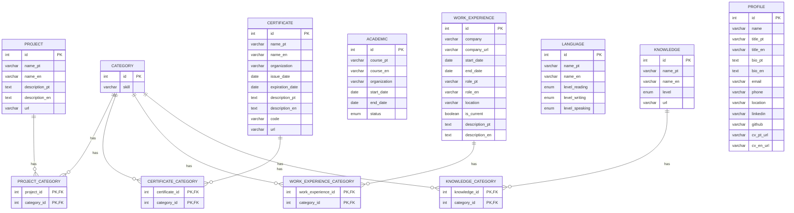

# 💻 Simulated CLI Portfolio

Este projeto é um portfólio interativo em forma de terminal (CLI), onde recrutadores e visitantes podem "brincar" com comandos para descobrir mais sobre mim, meus projetos, habilidades, currículo e formas de contato.

## 🚀 Funcionalidades

- Terminal interativo que simula um CLI na web.
- Comandos como `help`, `get about`, `get skills`, `get cv`, `get projects`, etc.
- Interface multilíngue: português e inglês.
- Currículo disponível para download via comando.
- Manual de comandos abaixo do terminal para facilitar o uso.
- Comandos com resposta dinâmica via API (Spring Boot).
- Banco de dados com projetos e certificados.
- Layout responsivo e acessível.

## Requisitos

- Java JDK 21
- Python 3
- Maven
- MySql

## 📂 Estrutura do Projeto

```
📦Portifolio CLI Simulado
 ┣ 📂backend
 ┃ ┣ 📂.mvn
 ┃ ┃ ┗ 📂wrapper
 ┃ ┃ ┃ ┗ 📜maven-wrapper.properties
 ┃ ┣ 📂src
 ┃ ┃ ┣ 📂main
 ┃ ┃ ┃ ┣ 📂java
 ┃ ┃ ┃ ┃ ┗ 📂com
 ┃ ┃ ┃ ┃ ┃ ┗ 📂luixguxto
 ┃ ┃ ┃ ┃ ┃ ┃ ┗ 📂br
 ┃ ┃ ┃ ┃ ┃ ┃ ┃ ┣ 📂config
 ┃ ┃ ┃ ┃ ┃ ┃ ┃ ┃ ┗ 📜CorsConfig.java
 ┃ ┃ ┃ ┃ ┃ ┃ ┃ ┣ 📂controller
 ┃ ┃ ┃ ┃ ┃ ┃ ┃ ┃ ┣ 📜CommandRequest.java
 ┃ ┃ ┃ ┃ ┃ ┃ ┃ ┃ ┗ 📜PortifolioController.java
 ┃ ┃ ┃ ┃ ┃ ┃ ┃ ┣ 📂model
 ┃ ┃ ┃ ┃ ┃ ┃ ┃ ┃ ┣ 📂entity
 ┃ ┃ ┃ ┃ ┃ ┃ ┃ ┃ ┃ ┗ 📜Profile.java
 ┃ ┃ ┃ ┃ ┃ ┃ ┃ ┃ ┣ 📂lang
 ┃ ┃ ┃ ┃ ┃ ┃ ┃ ┃ ┃ ┗ 📜ProfileLang.java
 ┃ ┃ ┃ ┃ ┃ ┃ ┃ ┃ ┣ 📂repository
 ┃ ┃ ┃ ┃ ┃ ┃ ┃ ┃ ┃ ┗ 📜ProfileRepository.java
 ┃ ┃ ┃ ┃ ┃ ┃ ┃ ┃ ┗ 📂service
 ┃ ┃ ┃ ┃ ┃ ┃ ┃ ┃ ┃ ┗ 📜ProfileService.java
 ┃ ┃ ┃ ┃ ┃ ┃ ┃ ┣ 📂util
 ┃ ┃ ┃ ┃ ┃ ┃ ┃ ┃ ┗ 📜Response.java
 ┃ ┃ ┃ ┃ ┃ ┃ ┃ ┗ 📜SimulatedCliApiApplication.java
 ┃ ┃ ┃ ┗ 📂resources
 ┃ ┃ ┃ ┃ ┗ 📜application.properties
 ┃ ┃ ┗ 📂test
 ┃ ┃ ┃ ┗ 📂java
 ┃ ┃ ┃ ┃ ┗ 📂com
 ┃ ┃ ┃ ┃ ┃ ┗ 📂luixguxto
 ┃ ┃ ┃ ┃ ┃ ┃ ┗ 📂br
 ┃ ┃ ┃ ┃ ┃ ┃ ┃ ┗ 📜SimulatedCliApiApplicationTests.java
 ┃ ┣ 📜.gitattributes
 ┃ ┣ 📜.gitignore
 ┃ ┣ 📜HELP.md
 ┃ ┣ 📜mvnw
 ┃ ┣ 📜mvnw.cmd
 ┃ ┗ 📜pom.xml
 ┣ 📂docs
 ┃ ┣ 📜1 - Lista de Regras de Negócio.pdf
 ┃ ┣ 📜2 - Lista de Requisitos Não Funcionais.pdf
 ┃ ┣ 📜3 - Lista de Requisitos Funcionais.pdf
 ┃ ┗ 📜Plano de Projeto.pdf
 ┣ 📂frontend
 ┃ ┣ 📂css
 ┃ ┃ ┗ 📜style.css
 ┃ ┣ 📂data
 ┃ ┃ ┣ 📂translations
 ┃ ┃ ┃ ┣ 📜en.json
 ┃ ┃ ┃ ┗ 📜pt.json
 ┃ ┃ ┗ 📜favicon.ico
 ┃ ┣ 📂js
 ┃ ┃ ┣ 📜api.js
 ┃ ┃ ┣ 📜buttons.js
 ┃ ┃ ┣ 📜cli.js
 ┃ ┃ ┗ 📜main.js
 ┃ ┗ 📜index.html
 ┣ 📜.gitignore
 ┣ 📜CLI_PORTFOLIO_DDL.sql
 ┣ 📜INSERTS_SELECTS_CLI_PORTIFOLIO.sql
 ┗ 📜README.md
```

## 🗃️ Estrutura do Banco de Dados


## 📦 Tecnologias Utilizadas

- Java + Spring Boot (API REST)
- Python ou Node.js (servidor local para o front-end)
- HTML, CSS, JavaScript e Bootstrap (front-end com estilo de terminal)
- JSON para internacionalização (i18n)
- MySQL (banco de dados)
- Git + GitHub

## 📥 Executar localmente

### Frontend (HTML + JS) 
```bash
cd frontend

python -m http.server 8000
# ou usando live-server 
npx live-server
```

### Backend (Spring Boot)
```bash
cd backend
./mvnw spring-boot:run
# ou
mvn spring-boot:run
```

## 🧪 Em desenvolvimento
Este projeto está em constante evolução. Fique à vontade para sugerir melhorias, reportar erros ou contribuir!

## Contatos
- Email: luisaugustoway@gmail.com
- linkedin: [luix-guxto](https://www.linkedin.com/in/luix-guxto/)